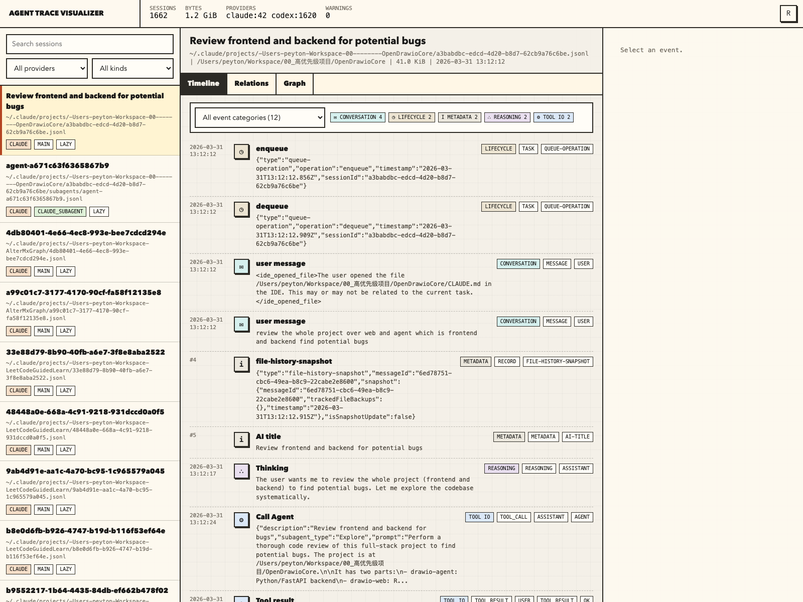

# Agent Trace Visualizer

Local, dependency-free visualizer for Codex and Claude Code JSONL traces.



## Install

From this directory:

```bash
python3 -m pip install -e .
```

This installs the `tvis` command.

## Usage

Scan the default local Codex and Claude Code history:

```bash
tvis
```

Visualize one JSONL file:

```bash
tvis /path/to/session.jsonl
```

Visualize every JSONL file under a directory:

```bash
tvis /path/to/trace-folder
```

Useful options:

```bash
tvis --no-open --port 0
tvis --provider codex /path/to/codex-traces
tvis --provider claude /path/to/claude-traces
tvis --eager-index /path/to/small-trace-folder
```

By default the server binds to `127.0.0.1`, chooses an available port, and opens the browser.

## Mermaid Analysis

The `Graph` tab automatically builds multiple Mermaid diagrams for the selected trace:

- Sequence diagram for ordered communication and handoffs
- Flowchart for communication topology
- State diagram for category transitions
- Timeline for phase-level changes across the JSONL
- Pie chart for event category mix
- Mindmap for trace inventory
- Journey diagram for the work shape

The page also includes a first-principles review explaining what each diagram preserves and what it intentionally compresses. It uses explicit Agent Team metadata when present, and otherwise infers communication from messages, tool calls, subagent spawns, wait/close handoffs, shell commands, search calls, patches, and token events.

Mermaid is served from the local `tvis` HTTP server, so the graph does not depend on a public CDN. If Mermaid still cannot be loaded in the browser, the page keeps a readable Mermaid source block so the graph can be copied into any Mermaid renderer.
